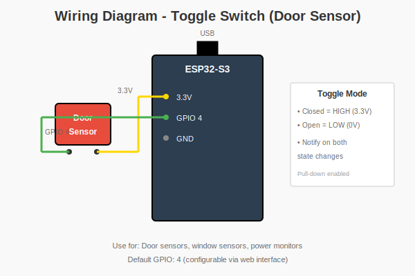
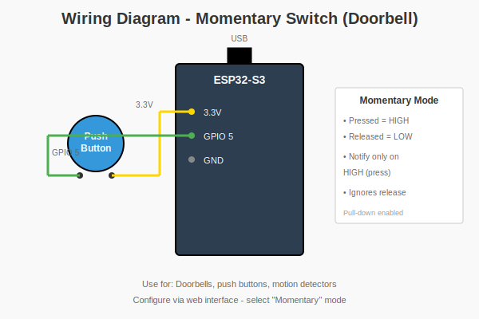
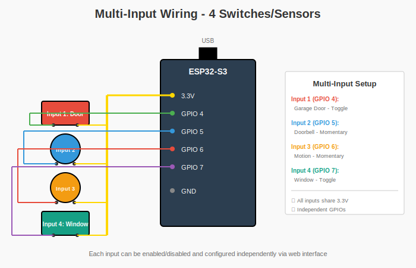

# ESP32-Notifier v2.0

A versatile IoT notification system that monitors **up to 4 switches** simultaneously and sends notifications via multiple channels (Pushbullet, Email, Telegram) when device states change.

## What's New in v2.0

- ✅ **WiFi Setup Mode** - Easy first-time setup via Access Point (no code editing needed!)
- ✅ **System Logs** - Web-based log viewer for triggers, notifications, and errors
- ✅ **Multi-input support** - Monitor up to 4 switches independently
- ✅ **WiFi auto-reconnection** - Automatic recovery from network drops
- ✅ **Watchdog timer** - Prevents system hangs
- ✅ **Web authentication** - Password-protected configuration interface
- ✅ **Non-blocking operations** - No more blocking delays
- ✅ **Notification retry** - Failed notifications auto-retry up to 3 times
- ✅ **Rate limiting** - Prevents notification spam (5s minimum interval per input)
- ✅ **Test buttons** - Test each notification service from web interface
- ✅ **Timezone dropdown** - Easy timezone selection
- ✅ **ArduinoJson** - Secure JSON handling prevents injection attacks
- ✅ **HTML encoding** - XSS protection

## Hardware Requirements

- ESP32-S3 development board
- Physical switch or relay
- USB cable for programming

## Features

- Real-time switch state monitoring
- **Multiple notification channels**:
  - 📱 **Pushbullet** - Push notifications to all your devices
  - 📧 **Email** - SMTP email notifications (Gmail, Outlook, etc.)
  - ⚡ **Telegram** - Instant messaging via Telegram bot
- **Web-based configuration interface** - no code changes needed
- WiFi connectivity with persistent settings storage
- NTP time synchronization
- Customizable notification messages with templates
- Individual enable/disable toggles for each notification service
- Debouncing for reliable switch detection
- Serial debug output with detailed diagnostics
- Live status monitoring

## Screenshots & Diagrams

### Web Interface

<table>
  <tr>
    <td><br/><i>WiFi Setup Mode (Access Point)</i></td>
    <td><br/><i>Main Configuration Interface</i></td>
  </tr>
  <tr>
    <td colspan="2"><br/><i>System Logs Viewer</i></td>
  </tr>
</table>

### Wiring Diagrams

<table>
  <tr>
    <td><br/><i>Toggle Switch (Door Sensor)</i></td>
    <td><br/><i>Momentary Switch (Doorbell)</i></td>
  </tr>
  <tr>
    <td colspan="2"><br/><i>Multi-Input Configuration (4 switches)</i></td>
  </tr>
</table>

### Example Output

- 📋 [Terminal Output Sample](docs/terminal-output.txt) - Serial monitor output with notifications
- 📊 [Sample Log File (JSON)](docs/sample-log.json) - System logs in JSON format

## Setup

### 1. Hardware Wiring

**Basic Single Input:**
- Connect your switch between GPIO4 and 3.3V
- Internal pull-down resistor is enabled
- Switch closed = HIGH (3.3V), Switch open = LOW (0V)

**Multi-Input Setup:**
- See [wiring diagram](docs/wiring-multi-input.svg) for connecting up to 4 inputs
- All inputs share common 3.3V power
- Each input uses a separate GPIO pin (default: 4, 5, 6, 7)
- Configure pins via web interface

### 2. Software Installation

1. Install Arduino IDE
2. Install ESP32 board support:
   - Go to File → Preferences
   - Add to Additional Board Manager URLs: `https://espressif.github.io/arduino-esp32/package_esp32_index.json`
   - Go to Tools → Board → Boards Manager
   - Search for "ESP32" and install "esp32 by Espressif Systems"

3. **Install required libraries**:
   - Go to Tools → Manage Libraries
   - Search for and install:
     - **"ESP Mail Client"** by Mobizt
     - **"ArduinoJson"** by Benoit Blanchon (v6.x or later)

4. Select your board:
   - Tools → Board → ESP32 Arduino → ESP32S3 Dev Module

5. **IMPORTANT - Set Partition Scheme**:
   - Tools → Partition Scheme → **"Huge APP (3MB No OTA/1MB SPIFFS)"**
   - This is required because the sketch uses multiple notification services and web interface
   - Without this setting, you'll get a "Sketch too big" compilation error

### 3. Upload

1. Connect ESP32-S3 via USB
2. Select the correct COM port (Tools → Port)
3. Click Upload
4. Open Serial Monitor (115200 baud) to view debug output

### 4. First-Time WiFi Setup

**On first boot (or when WiFi credentials are empty), the device automatically enters Setup Mode:**

1. The device creates a WiFi Access Point named `ESP32-Notifier-Setup`
2. Connect to this network using password: `setup123`
3. Open your browser and navigate to `http://192.168.4.1`
4. Enter your WiFi network name (SSID) and password
5. Click "Connect to WiFi"
6. The device will restart and connect to your WiFi network
7. Check the Serial Monitor for the new IP address (e.g., `192.168.1.100`)
8. Navigate to that IP address to access the full configuration interface

**Default Settings:**
- **Web Username:** `admin`
- **Web Password:** `admin123` ⚠️ **CHANGE THIS IMMEDIATELY**
- **Pushbullet:** Disabled by default
- Input 1: GPIO4 (enabled by default)
- Inputs 2-4: GPIO 5, 6, 7 (disabled by default)

## Usage

### Basic Operation

Once running, the device will:
1. Enable 30-second watchdog timer
2. Connect to WiFi (non-blocking)
3. Sync time via NTP
4. Start password-protected web server
5. Monitor all enabled inputs independently
6. Send notifications when any input state changes
7. Auto-reconnect WiFi if connection drops
8. Retry failed notifications up to 3 times

### Web Configuration Interface

After uploading, check the Serial Monitor (115200 baud) to find the device's IP address. Then:

1. **Access the web interface**:
   - Open your browser and navigate to the IP address shown in Serial Monitor (e.g., `http://192.168.1.100`)
   - **Login with:** Username: `admin`, Password: `admin123`
   - ⚠️ **Change the password immediately** for security

2. **Available Settings**:
   - **WiFi Settings**: Change network credentials
   - **Web Authentication**: Change username and password
   - **Pushbullet Settings**: Enable/disable, update API token, **Test button**
   - **Email Settings**: Enable/disable, configure SMTP server, credentials, recipient, **Test button**
   - **Telegram Settings**: Enable/disable, configure bot token and chat ID, **Test button**
   - **Inputs Configuration** (up to 4 inputs):
     - Enable/disable each input
     - Custom name for each input
     - GPIO pin assignment
     - Mode (Toggle or Momentary)
     - Custom ON and OFF messages with `{timestamp}` placeholder
   - **General Settings**: Notification title, timezone offset

3. **Web Interface Features**:
   - Live status display (WiFi, IP, all input states, uptime)
   - **System Logs** - View last 100 events (triggers, notifications, errors)
   - **Test buttons** for each notification service
   - Save configuration (persists across reboots)
   - Restart device remotely
   - All settings stored in non-volatile memory
   - Password-protected (HTTP Basic Authentication)

4. **Switch Modes**:
   - **Toggle Mode** (default): Sends notifications on both state changes
     - Use for: Door sensors, power monitors, window sensors
     - Notifies when: Device turns ON and when it turns OFF

   - **Momentary Mode**: Only sends notification when switch goes HIGH
     - Use for: Doorbells, motion detectors, push buttons
     - Notifies when: Trigger detected (ignores release)

5. **Example Custom Messages**:

   **Toggle Mode (door sensor):**
   ```
   ON:  "🟢 Garage door opened at {timestamp}"
   OFF: "🔴 Garage door closed at {timestamp}"
   ```

   **Momentary Mode (doorbell):**
   ```
   ON:  "🔔 Doorbell pressed at {timestamp}"
   OFF: (not used in momentary mode)
   ```

   **Momentary Mode (motion detector):**
   ```
   ON:  "⚠️ Motion detected at {timestamp}"
   ```

### Setting Up Notification Services

#### Pushbullet Setup
1. Go to https://www.pushbullet.com/#settings/account
2. Create an Access Token
3. Copy the token and paste it in the web interface
4. Enable Pushbullet notifications

#### Email Setup (Gmail Example)
1. **Enable 2-Factor Authentication** on your Google account
2. Go to https://myaccount.google.com/apppasswords
3. Create an App Password (select "Mail" and your device)
4. In the web interface:
   - SMTP Server: `smtp.gmail.com`
   - SMTP Port: `465` (SSL) or `587` (TLS)
   - Your Email: your Gmail address
   - Password: the 16-character app password (no spaces)
   - Recipient Email: where you want to receive notifications
5. Enable Email notifications

**Other Email Providers:**
- **Outlook/Hotmail**: `smtp-mail.outlook.com`, Port `587`
- **Yahoo**: `smtp.mail.yahoo.com`, Port `465` or `587`
- **Custom SMTP**: Enter your provider's SMTP settings

#### Telegram Setup
1. **Create a Bot**:
   - Open Telegram and search for `@BotFather`
   - Send `/newbot` and follow instructions
   - Copy the Bot Token (format: `123456:ABC-DEF1234ghIkl-zyx57W2v1u123ew11`)

2. **Get Your Chat ID**:
   - Search for `@userinfobot` on Telegram
   - Start a chat and it will send you your Chat ID (e.g., `123456789`)
   - Or send a message to your bot, then visit: `https://api.telegram.org/bot<YourBotToken>/getUpdates`

3. In the web interface:
   - Paste your Bot Token
   - Paste your Chat ID
   - Enable Telegram notifications

4. **Start your bot**: Send `/start` to your bot on Telegram

### Changing WiFi Networks

If you need to connect to a different WiFi network:

1. **Method 1: Reset via Web Interface** (Recommended)
   - Log in to the web interface
   - Go to the WiFi section
   - Click the red "Reset WiFi" button
   - Confirm the action
   - Device will restart in Access Point mode
   - Connect to `ESP32-Notifier-Setup` network (password: `setup123`)
   - Navigate to `http://192.168.4.1`
   - Configure new WiFi credentials

2. **Method 2: Edit via Web Interface**
   - If you can still access the device on your network
   - Simply update the SSID and Password fields
   - Click "Save Configuration"
   - Device will connect to the new network

3. **Method 3: Re-flash Firmware**
   - If you can't access the device at all
   - Re-upload the sketch via Arduino IDE
   - Device will start fresh in AP mode

## Troubleshooting

### General Issues
- **Compilation error "Sketch too big"**:
  - Go to Tools → Partition Scheme → "Huge APP (3MB No OTA/1MB SPIFFS)"
  - This is required for the sketch to fit in flash memory
- **WiFi won't connect**: Check SSID and password in web interface or code
- **Can't access web interface**: Check Serial Monitor for IP address; ensure you're on the same network
- **Time shows incorrect**: Adjust GMT offset in web interface (e.g., -14400 for EDT, -18000 for EST, 3600 for CET)
- **False triggers**: Increase debounce delay (currently 50ms in code)
- **Settings not persisting**: Configuration is saved to ESP32 flash memory automatically when you click "Save Configuration"
- **Serial Monitor blank**: Enable "USB CDC On Boot" in Arduino IDE Tools menu

### Notification Service Issues
- **Pushbullet not working**:
  - Verify token at https://www.pushbullet.com/#settings/account
  - Ensure Pushbullet is enabled in web interface

- **Email not sending**:
  - Check SMTP server and port settings
  - For Gmail: Must use App Password (not regular password) with 2FA enabled
  - Verify your email provider allows SMTP access
  - Check Serial Monitor for specific error messages

- **Telegram not working**:
  - Ensure you've sent `/start` to your bot first
  - Verify Chat ID is correct (use @userinfobot)
  - Check that bot token is valid
  - Make sure Telegram is enabled in web interface

## Serial Monitor Output

Expected output with multiple notification services:
```

=== ESP32-Notifier v2.0 ===
Watchdog timer enabled (30s)
Preferences loaded
Input 1 (Input 1) on pin 4: LOW
Connecting to WiFi: YourNetwork
...
WiFi connected!
IP address: 192.168.1.100
Waiting for time sync...
Time synchronized!
Web server started
Configuration page: http://192.168.1.100
Initial switch state: OFF
Pin 4 state: 0 | Last: 0 | Current: 0 | WiFi: Connected
State change detected! New current state: 1
=== STATE CHANGE CONFIRMED ===
Device turned ON at 2025-10-03 14:30:45
--- Sending Notifications ---
Sending Pushbullet...
✓ Pushbullet sent! Code: 200
Sending Email...
✓ Email sent!
Sending Telegram...
✓ Telegram sent! Code: 200
--- Notifications Complete ---
```

## License

MIT
