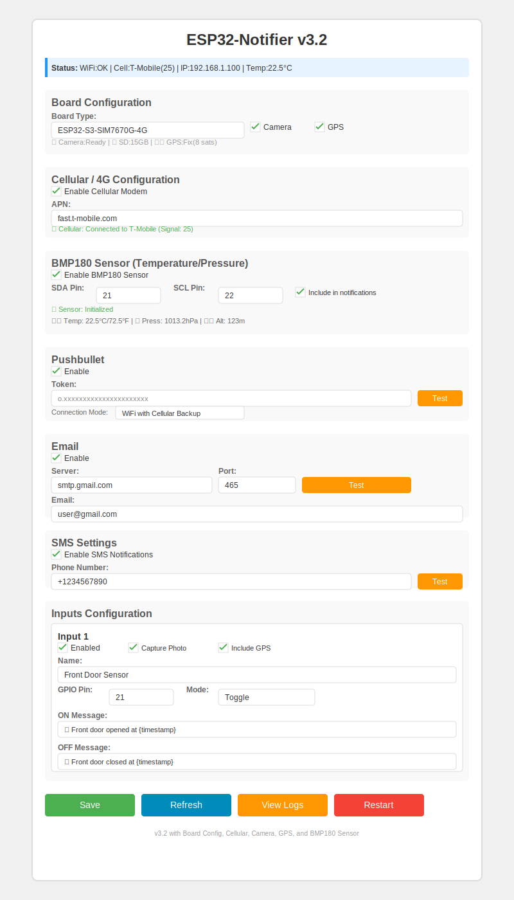
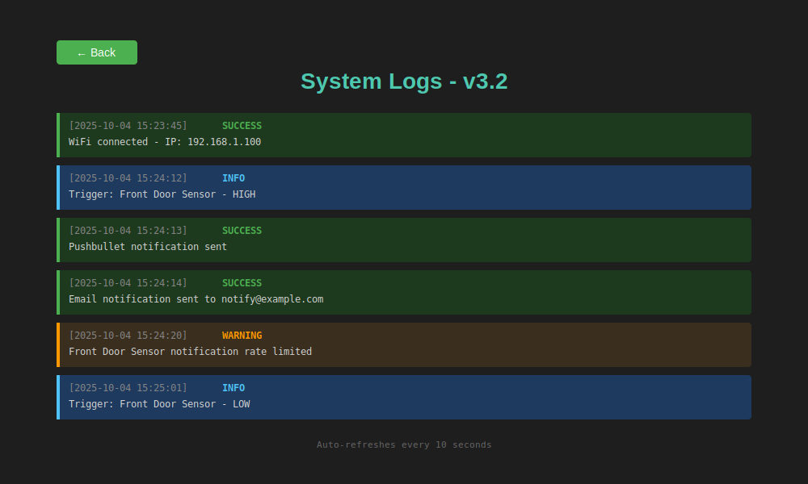

# ESP32-Notifier v3.2

An advanced IoT notification and monitoring system that supports **multi-board configurations**, **cellular/4G connectivity**, **camera with photo capture**, **GPS tracking**, and **environmental sensing**. Monitor up to 4 inputs simultaneously and receive notifications via Pushbullet, Email, Telegram, or SMS.

## 🎉 What's New in v3.2 (Current Release)

- 🌡️ **BMP180 Environmental Sensor** - Temperature and pressure monitoring
- 📊 **Live Sensor Readings** - Real-time temperature, pressure, and altitude in web interface
- 📈 **Sensor Data in Notifications** - Automatic environmental data appended to alerts
- 🔧 **Configurable I2C Pins** - Flexible GPIO pin assignment for sensor connection
- ⚖️ **Dual Units** - Metric and imperial units (°C/°F, hPa/inHg, m/ft)

## 🚀 What's New in v3.1

- 📶 **Cellular/4G Support** - SIM7670G modem integration for mobile connectivity
- 📱 **SMS Notifications** - Send alerts via text message
- 🔀 **Intelligent Connection Modes** - WiFi Only, Cellular Only, or WiFi with Cellular Backup
- 📡 **HTTP over Cellular** - Pushbullet and Telegram over mobile network
- 📊 **Cellular Status Monitoring** - Operator name and signal strength display
- ⚙️ **Per-Service Connection Mode** - Configure connection preference for each notification service
- 📞 **Configurable APN** - Support for various mobile carriers

## 🎥 What's New in v3.0

- 🎛️ **Multi-Board Support** - Three board configurations (Generic ESP32-S3, Waveshare SIM7670G, Freenove CAM)
- 📷 **OV2640 Camera Integration** - Capture photos when inputs trigger
- 📸 **Photo Attachments** - Include images in Email and Telegram notifications
- 💾 **SD Card Storage** - Save photos to SD card (1-bit and 4-bit modes)
- 🛰️ **GPS/GNSS Positioning** - Include location coordinates in notifications
- 🗺️ **Per-Input GPS/Camera** - Enable photo capture and GPS per input independently
- 🎚️ **Board-Specific Optimization** - Safe GPIO pin defaults based on board type

## ✨ Core Features from v2.0

- ✅ **WiFi Network Scanner** - Scan and select networks during setup
- ✅ **WiFi Setup Mode** - Access Point for first-time configuration (no code editing!)
- ✅ **System Logs** - Web-based log viewer with 100-entry circular buffer
- ✅ **Multi-input Support** - Monitor up to 4 switches independently
- ✅ **WiFi Auto-Reconnection** - Automatic recovery from network drops
- ✅ **Watchdog Timer** - Prevents system hangs and auto-recovers from crashes
- ✅ **Web Authentication** - Password-protected configuration interface
- ✅ **Non-blocking Operations** - No blocking delays for smooth operation
- ✅ **Notification Retry** - Failed notifications auto-retry up to 3 times
- ✅ **Rate Limiting** - Prevents notification spam (5s minimum interval per input)
- ✅ **Test Buttons** - Test each notification service from web interface
- ✅ **Timezone Support** - Easy timezone selection (UTC-12 to UTC+14)
- ✅ **ArduinoJson** - Secure JSON handling prevents injection attacks
- ✅ **HTML Encoding** - XSS protection for user-supplied content

## Hardware Requirements

### Basic Setup (All Configurations)
- **ESP32-S3 development board** (any variant)
- **Physical switch or relay** (for input monitoring)
- **USB cable** for programming

### Board-Specific Options

**Option 1: Generic ESP32-S3** (WiFi only)
- Standard ESP32-S3 DevKit or similar
- WiFi-only notifications
- Cost-effective for basic monitoring

**Option 2: ESP32-S3-SIM7670G-4G** ([Waveshare](https://www.waveshare.com/))
- Integrated SIM7670G cellular modem
- OV2640 camera module
- SD card slot (for photo storage)
- GPS/GNSS capability
- Requires: Nano SIM card with data plan

**Option 3: Freenove ESP32-S3 CAM**
- OV2640 camera module
- SD card slot
- WiFi-only (no cellular)

### Board Pinout References

<table>
  <tr>
    <td width="33%"><br/><i>Generic ESP32-S3 Wroom Pinout</i></td>
    <td width="33%"><br/><i>Waveshare ESP32-S3-SIM7670G-4G Pinout</i></td>
    <td width="33%"><br/><i>Seeed Studio/Freenove ESP32-S3 Pinout</i></td>
  </tr>
</table>

> 💡 **Note**: Use these pinout diagrams when configuring custom GPIO pins for inputs, I2C devices, or troubleshooting pin conflicts with board-specific features (camera, modem, etc.)

### Optional Components
- **BMP180/BMP085 Sensor** - For temperature and pressure monitoring
  - Requires: I2C connection (2 GPIO pins)
- **SD Card** - For camera photo storage (FAT32 formatted)
  - Recommended: Class 10, 8GB-32GB
- **Nano SIM Card** - For cellular connectivity (SIM7670G board only)
  - Requires: Data plan with mobile carrier

## Features

### Core Capabilities
- ⚡ **Real-time Multi-Input Monitoring** - Monitor up to 4 independent switches/sensors
- 🌐 **Dual Connectivity** - WiFi and/or Cellular (4G LTE)
- 🔔 **Four Notification Channels**:
  - 📱 **Pushbullet** - Push notifications to all your devices
  - 📧 **Email** - SMTP email notifications (Gmail, Outlook, etc.)
  - ⚡ **Telegram** - Instant messaging via Telegram bot
  - 📱 **SMS** - Text messages via cellular modem (SIM7670G boards)

### Advanced Features
- 📷 **Photo Capture** - Take photos with OV2640 camera when inputs trigger
- 📸 **Photo Attachments** - Include images in Email and Telegram notifications
- 🛰️ **GPS Tracking** - Include location coordinates in alerts
- 🌡️ **Environmental Sensing** - Monitor temperature, pressure, and altitude (BMP180)
- 💾 **SD Card Storage** - Save photos and logs to SD card
- 🔀 **Intelligent Connection Modes** - Choose WiFi, Cellular, or automatic failover per service

### Configuration & Management
- 🌐 **Web-based Configuration** - No code changes needed
- 🔐 **Password-Protected Interface** - HTTP Basic Authentication
- 📊 **Live Status Dashboard** - Real-time WiFi, cellular, sensor, and input monitoring
- 📝 **System Logs** - Web-based log viewer (last 100 events)
- 🧪 **Test Buttons** - Test each notification service independently
- ⏰ **NTP Time Sync** - Accurate timestamps with timezone support
- 💾 **Persistent Storage** - All settings saved to flash memory

### Reliability & Safety
- 🔄 **Auto-Reconnection** - WiFi and cellular auto-recovery
- 🐕 **Watchdog Timer** - Prevents system hangs (30s timeout)
- 🔁 **Notification Retry** - Up to 3 attempts for failed notifications
- ⏱️ **Rate Limiting** - Prevents notification spam (5s interval per input)
- 🚫 **Non-blocking Operations** - Smooth operation without delays
- 🔒 **Security Features** - XSS protection and JSON injection prevention

## Screenshots & Diagrams

### Web Interface

<table>
  <tr>
    <td><br/><i>WiFi Setup Mode with Network Scanner</i></td>
    <td><br/><i>Main Configuration Interface</i></td>
  </tr>
  <tr>
    <td colspan="2"><br/><i>System Logs Viewer</i></td>
  </tr>
</table>

> 💡 **Note**: Interactive HTML versions available in [`docs/`](docs/) folder

### Wiring Diagrams

<table>
  <tr>
    <td><br/><i>Toggle Switch (Door Sensor)</i></td>
    <td><br/><i>Momentary Switch (Doorbell)</i></td>
  </tr>
  <tr>
    <td colspan="2"><br/><i>Multi-Input Configuration (4 switches)</i></td>
  </tr>
</table>

### Example Output

- 📋 [Terminal Output Sample](docs/terminal-output.txt) - Serial monitor output with notifications
- 📊 [Sample Log File (JSON)](docs/sample-log.json) - System logs in JSON format

## Setup

### 1. Hardware Wiring

**Basic Single Input:**
- Connect your switch between GPIO4 and 3.3V
- Internal pull-down resistor is enabled
- Switch closed = HIGH (3.3V), Switch open = LOW (0V)

**Multi-Input Setup:**
- See [wiring diagram](docs/wiring-multi-input.svg) for connecting up to 4 inputs
- All inputs share common 3.3V power
- Each input uses a separate GPIO pin (default: 4, 5, 6, 7)
- Configure pins via web interface

### 2. Software Installation

1. Install Arduino IDE
2. Install ESP32 board support:
   - Go to File → Preferences
   - Add to Additional Board Manager URLs: `https://espressif.github.io/arduino-esp32/package_esp32_index.json`
   - Go to Tools → Board → Boards Manager
   - Search for "ESP32" and install "esp32 by Espressif Systems"

3. **Install required libraries**:
   - Go to Tools → Manage Libraries
   - Search for and install:

   **Required (All Configurations):**
     - **"ESP Mail Client"** by Mobizt (for Email notifications)
     - **"ArduinoJson"** by Benoit Blanchon (v6.x or later - for JSON parsing)

   **Optional (Advanced Features):**
     - **"Adafruit BMP085 Library"** (for BMP180 sensor - works with both BMP085 and BMP180)
       - Also install dependencies: "Adafruit Unified Sensor" and "Adafruit BusIO"
     - **"TinyGPSPlus"** by Mikal Hart (for GPS/GNSS support - SIM7670G boards only)

   > 💡 **Note**: Optional libraries can be disabled by commenting out the corresponding `#define` in code:
   > - `HAS_BMP180_LIB` for BMP180 sensor
   > - `HAS_CAMERA_LIB` for camera support
   > - `HAS_GPS_LIB` for GPS/GNSS

4. Select your board:
   - Tools → Board → ESP32 Arduino → ESP32S3 Dev Module

5. **⚠️ CRITICAL - Set Partition Scheme ⚠️**:
   - **YOU MUST CHANGE THIS OR COMPILATION WILL FAIL**
   - Go to: Tools → Partition Scheme → **"Huge APP (3MB No OTA/1MB SPIFFS)"**
   - ⚠️ **This is REQUIRED** - the sketch will NOT compile with the default partition scheme
   - Without this setting, you'll get error: **"Sketch too big"** or **"text section exceeds available space"**
   - **If you see compilation errors about size, check this setting first!**

6. **Camera Boards: Enable PSRAM** (SIM7670G and Freenove only):
   - Go to: Tools → PSRAM → **"OPI PSRAM"** (for Waveshare/Freenove boards)
   - This is REQUIRED for camera operation
   - Without PSRAM, camera initialization will fail

### 3. Upload

1. Connect ESP32-S3 via USB
2. Select the correct COM port (Tools → Port)
3. Click Upload
4. Open Serial Monitor (115200 baud) to view debug output

### 4. First-Time WiFi Setup

**On first boot (or when WiFi credentials are empty), the device automatically enters Setup Mode:**

1. The device creates a WiFi Access Point named `ESP32-Notifier-Setup`
2. Connect to this network using password: `setup123`
3. Open your browser and navigate to `http://192.168.4.1`
4. **NEW: Click "Scan for Networks"** to see all available WiFi networks with signal strength
5. Click on any network to auto-fill the SSID, or manually enter your WiFi network name
6. Enter your WiFi password
7. Click "Connect to WiFi"
8. The device will restart and connect to your WiFi network
9. Check the Serial Monitor for the new IP address (e.g., `192.168.1.100`)
10. Navigate to that IP address to access the full configuration interface

**Default Settings:**
- **Web Username:** `admin`
- **Web Password:** `admin123` ⚠️ **CHANGE THIS IMMEDIATELY**
- **Pushbullet:** Disabled by default
- Input 1: GPIO4 (enabled by default)
- Inputs 2-4: GPIO 5, 6, 7 (disabled by default)

## Usage

### Basic Operation

Once running, the device will:
1. Enable 30-second watchdog timer
2. Connect to WiFi (non-blocking)
3. Sync time via NTP
4. Start password-protected web server
5. Monitor all enabled inputs independently
6. Send notifications when any input state changes
7. Auto-reconnect WiFi if connection drops
8. Retry failed notifications up to 3 times

### Web Configuration Interface

After uploading, check the Serial Monitor (115200 baud) to find the device's IP address. Then:

1. **Access the web interface**:
   - Open your browser and navigate to the IP address shown in Serial Monitor (e.g., `http://192.168.1.100`)
   - **Login with:** Username: `admin`, Password: `admin123`
   - ⚠️ **Change the password immediately** for security

2. **Available Settings**:

   **Basic Configuration:**
   - **WiFi Settings**: Change network credentials, Reset WiFi button
   - **Web Authentication**: Change username and password
   - **Board Configuration**: Board type selection, Camera/GPS/Cellular toggles

   **Notification Services:**
   - **Pushbullet Settings**: Enable/disable, API token, connection mode, **Test button**
   - **Email Settings**: Enable/disable, SMTP server/port, credentials, recipient, connection mode, **Test button**
   - **Telegram Settings**: Enable/disable, bot token, chat ID, connection mode, **Test button**
   - **SMS Settings** (SIM7670G only): Enable/disable, phone number, connection mode

   **Cellular Configuration** (SIM7670G only):
   - Enable/disable cellular modem
   - APN configuration
   - Connection mode per service
   - Status: Operator name, signal strength

   **Environmental Sensor:**
   - **BMP180 Sensor**: Enable/disable, I2C pin configuration (SDA/SCL)
   - Include sensor data in notifications toggle
   - Live readings: Temperature, Pressure, Altitude

   **Inputs Configuration** (up to 4 inputs):
   - Enable/disable each input
   - Custom name for each input
   - GPIO pin assignment (board-specific safe defaults)
   - Mode (Toggle or Momentary)
   - Custom ON and OFF messages with `{timestamp}` placeholder
   - **Camera trigger**: Capture photo when input triggers (camera boards only)
   - **GPS inclusion**: Include GPS coordinates in notification (SIM7670G only)

   **General Settings:**
   - Notification title
   - Timezone offset (dropdown with major timezones)

3. **Web Interface Features**:
   - Live status display (WiFi, IP, all input states, uptime)
   - **System Logs** - View last 100 events (triggers, notifications, errors)
   - **Test buttons** for each notification service
   - Save configuration (persists across reboots)
   - Restart device remotely
   - All settings stored in non-volatile memory
   - Password-protected (HTTP Basic Authentication)

4. **Switch Modes**:
   - **Toggle Mode** (default): Sends notifications on both state changes
     - Use for: Door sensors, power monitors, window sensors
     - Notifies when: Device turns ON and when it turns OFF

   - **Momentary Mode**: Only sends notification when switch goes HIGH
     - Use for: Doorbells, motion detectors, push buttons
     - Notifies when: Trigger detected (ignores release)

5. **Example Custom Messages**:

   **Toggle Mode (door sensor):**
   ```
   ON:  "🟢 Garage door opened at {timestamp}"
   OFF: "🔴 Garage door closed at {timestamp}"
   ```

   **Momentary Mode (doorbell):**
   ```
   ON:  "🔔 Doorbell pressed at {timestamp}"
   OFF: (not used in momentary mode)
   ```

   **Momentary Mode (motion detector):**
   ```
   ON:  "⚠️ Motion detected at {timestamp}"
   ```

### Setting Up Notification Services

#### Pushbullet Setup
1. Go to https://www.pushbullet.com/#settings/account
2. Create an Access Token
3. Copy the token and paste it in the web interface
4. Enable Pushbullet notifications

#### Email Setup (Gmail Example)
1. **Enable 2-Factor Authentication** on your Google account
2. Go to https://myaccount.google.com/apppasswords
3. Create an App Password (select "Mail" and your device)
4. In the web interface:
   - SMTP Server: `smtp.gmail.com`
   - SMTP Port: `465` (SSL) or `587` (TLS)
   - Your Email: your Gmail address
   - Password: the 16-character app password (no spaces)
   - Recipient Email: where you want to receive notifications
5. Enable Email notifications

**Other Email Providers:**
- **Outlook/Hotmail**: `smtp-mail.outlook.com`, Port `587`
- **Yahoo**: `smtp.mail.yahoo.com`, Port `465` or `587`
- **Custom SMTP**: Enter your provider's SMTP settings

#### Telegram Setup
1. **Create a Bot**:
   - Open Telegram and search for `@BotFather`
   - Send `/newbot` and follow instructions
   - Copy the Bot Token (format: `123456:ABC-DEF1234ghIkl-zyx57W2v1u123ew11`)

2. **Get Your Chat ID**:
   - Search for `@userinfobot` on Telegram
   - Start a chat and it will send you your Chat ID (e.g., `123456789`)
   - Or send a message to your bot, then visit: `https://api.telegram.org/bot<YourBotToken>/getUpdates`

3. In the web interface:
   - Paste your Bot Token
   - Paste your Chat ID
   - Enable Telegram notifications

4. **Start your bot**: Send `/start` to your bot on Telegram

#### SMS Setup (SIM7670G Boards Only)
1. Insert a Nano SIM card with an active data plan
2. In the web interface:
   - Navigate to **"Cellular / 4G Configuration"**
   - Enable cellular modem
   - Enter your carrier's APN (e.g., "internet", "wholesale", "fast.t-mobile.com")
   - Navigate to **"SMS Settings"**
   - Enable SMS notifications
   - Enter recipient phone number with country code (e.g., "+1234567890")
3. Device will connect to cellular network on boot
4. SMS will be sent via cellular modem when inputs trigger

### Board Selection & Configuration

Navigate to the **"Board Configuration"** section in the web interface to select your board type:

#### Quick Comparison

| Feature | Generic ESP32-S3 | Waveshare SIM7670G | Freenove CAM |
|---------|------------------|-------------------|--------------|
| **WiFi** | ✅ | ✅ | ✅ |
| **Cellular/4G** | ❌ | ✅ | ❌ |
| **Camera** | ❌ | ✅ OV2640 | ✅ OV2640 |
| **GPS** | ❌ | ✅ | ❌ |
| **SD Card** | ❌ | ✅ | ✅ |
| **SMS** | ❌ | ✅ | ❌ |
| **Pushbullet** | ✅ | ✅ | ✅ |
| **Email** | ✅ | ✅ | ✅ |
| **Telegram** | ✅ | ✅ | ✅ |
| **Default Pins** | 1, 2, 3, 47 | 21, 38, 39, 40 | Board-specific |
| **Pinout Diagram** | [View](docs/images/ESP32-S3%20Wroom.png) | [View](docs/images/ESP32-S3%20SIM7670G%204G%20Development%20Board.jpg) | [View](docs/images/SeeedStudio%20ESP32S3.jpg) |
| **Best For** | Basic monitoring | Full-featured remote | WiFi camera alerts |

#### Option 1: Generic ESP32-S3
- **Features**: WiFi notifications only
- **Supported Services**: Pushbullet, Email, Telegram
- **Default GPIO Pins**: 1, 2, 3, 47
- **Use Case**: Cost-effective monitoring without camera/GPS
- **Configuration**: Select "Generic ESP32-S3" from dropdown
- **Pinout**: See [Generic ESP32-S3 Wroom pinout diagram](docs/images/ESP32-S3%20Wroom.png)

#### Option 2: ESP32-S3-SIM7670G-4G (Waveshare)
- **Features**: WiFi + Cellular + Camera + GPS + SD Card
- **Supported Services**: All (Pushbullet, Email, Telegram, SMS)
- **Default GPIO Pins**: 21, 38, 39, 40 (safe pins that avoid modem/camera conflicts)
- **Additional Hardware Required**:
  - Nano SIM card with data plan
  - SD card (FAT32, Class 10 recommended)
- **Configuration**:
  - Select "ESP32-S3-SIM7670G-4G (Waveshare)" from dropdown
  - Enable Camera checkbox for photo capture
  - Enable GPS checkbox for location tracking
  - Enable Cellular checkbox for mobile connectivity
- **Pinout**: See [Waveshare SIM7670G pinout diagram](docs/images/ESP32-S3%20SIM7670G%204G%20Development%20Board.jpg)

#### Option 3: Freenove ESP32-S3 CAM
- **Features**: WiFi + Camera + SD Card
- **Supported Services**: Pushbullet, Email, Telegram
- **Default GPIO Pins**: Board-specific safe pins
- **Additional Hardware Required**: SD card (FAT32 formatted)
- **Configuration**:
  - Select "Freenove ESP32-S3 CAM" from dropdown
  - Enable Camera checkbox for photo capture
- **Pinout**: See [Seeed Studio/Freenove pinout diagram](docs/images/SeeedStudio%20ESP32S3.jpg)

### Advanced Features Setup

#### 📷 Camera & Photo Capture

**Hardware Setup:**
- Ensure OV2640 camera is properly connected
- Insert FAT32-formatted SD card (8-32GB recommended)
- Enable PSRAM in Arduino IDE (Tools → PSRAM → OPI PSRAM)

**Software Configuration:**
1. In web interface, navigate to **"Board Configuration"**
2. Select appropriate board (SIM7670G or Freenove)
3. Check **"Enable Camera (OV2640)"**
4. Click "Save Configuration"
5. Device will initialize camera on restart

**Per-Input Photo Triggers:**
1. Navigate to **"Inputs Configuration"**
2. For each input, check **"Capture Photo"** to enable photo on trigger
3. Photos are automatically attached to Email and Telegram notifications
4. Photos saved to SD card with timestamp (e.g., `/20251015_143045.jpg`)

**Status Indicators:**
- Web interface shows: "📷 Camera: Ready" when initialized
- "💾 SD Card: XXX MB" when card detected
- Error messages if camera or SD card fails

#### 🛰️ GPS/GNSS Location Tracking

**Requirements:**
- ESP32-S3-SIM7670G-4G board only
- Cellular modem must be enabled
- Clear view of sky for GPS fix (may take 1-2 minutes outdoors)

**Configuration:**
1. Enable **Cellular Modem** in web interface
2. Check **"Enable GPS/GNSS"** in Board Configuration
3. GPS powers on automatically with modem

**Per-Input GPS:**
1. Navigate to **"Inputs Configuration"**
2. For each input, check **"Include GPS Location"**
3. Location coordinates will be included in notifications when input triggers
4. Format: "GPS: Lat: 40.7128, Lon: -74.0060, Alt: 10.0m (4 sats)"

**Status:**
- Web interface shows satellite count and fix status
- "GPS: Fix (8 sats)" when locked
- "GPS: Searching" when acquiring signal

#### 📶 Cellular/4G Connectivity

**Hardware Requirements:**
- ESP32-S3-SIM7670G-4G board
- Nano SIM card with active data plan
- Compatible carrier (most GSM/LTE carriers supported)

**Initial Setup:**
1. Power off device and insert Nano SIM card
2. Power on and navigate to web interface
3. In **"Cellular / 4G Configuration"**:
   - Check **"Enable Cellular Modem"**
   - Enter APN for your carrier:
     - T-Mobile: `fast.t-mobile.com` or `wholesale`
     - AT&T: `broadband` or `phone`
     - Verizon: `vzwinternet`
     - Other carriers: Check carrier documentation
4. Save configuration and restart

**Connection Modes:**

For each notification service, choose:
- **WiFi Only**: Use WiFi connection (default, most reliable for Pushbullet/Email/Telegram)
- **Cellular Only**: Use mobile data (best for areas without WiFi)
- **WiFi with Cellular Backup**: Try WiFi first, fall back to cellular if WiFi unavailable

**Status Monitoring:**
- Cellular status shown in web interface:
  - "📶 Cellular: Connected to T-Mobile (Signal: 25)"
  - Operator name and signal strength
  - Connection state (Connected/Disconnected)

**Use Cases:**
- Remote locations without WiFi
- Backup connectivity when WiFi fails
- Mobile installations (vehicles, portable devices)

#### 🌡️ Environmental Monitoring (BMP180)

**Hardware Setup:**
```
BMP180 Sensor     ESP32-S3
─────────────     ────────
VCC (3.3V)   ->   3.3V
GND          ->   GND
SDA          ->   GPIO21 (default, configurable)
SCL          ->   GPIO22 (default, configurable)
```

**Software Configuration:**
1. Install **"Adafruit BMP085 Library"** in Arduino IDE
2. In web interface, navigate to **"BMP180 Sensor"** section
3. Check **"Enable BMP180 Sensor"**
4. Configure I2C pins (default: SDA=21, SCL=22)
5. Check **"Include sensor data in notifications"**
6. Save configuration

**Live Readings:**
- Web interface displays real-time data:
  - 🌡️ Temperature: 22.5°C / 72.5°F
  - 🔽 Pressure: 1013.2 hPa / 29.92 inHg
  - ⛰️ Altitude: 123.4 m / 404.9 ft

**In Notifications:**
When enabled, sensor data is automatically appended:
```
Input 1 ON at 2025-10-15 14:30:45

🌡️  Temperature: 22.5°C / 72.5°F
🔽 Pressure: 1013.2 hPa / 29.92 inHg
⛰️  Altitude: 123.4 m / 404.9 ft
```

**Troubleshooting:**
- If "⚠️ Sensor not detected" appears:
  - Verify wiring connections
  - Check I2C pin configuration
  - Try different GPIO pins if conflict exists
  - See [BMP180_SETUP.md](BMP180_SETUP.md) for detailed guide

### Changing WiFi Networks

If you need to connect to a different WiFi network:

1. **Method 1: Reset via Web Interface** (Recommended)
   - Log in to the web interface
   - Go to the WiFi section
   - Click the red "Reset WiFi" button
   - Confirm the action
   - Device will restart in Access Point mode
   - Connect to `ESP32-Notifier-Setup` network (password: `setup123`)
   - Navigate to `http://192.168.4.1`
   - Configure new WiFi credentials

2. **Method 2: Edit via Web Interface**
   - If you can still access the device on your network
   - Simply update the SSID and Password fields
   - Click "Save Configuration"
   - Device will connect to the new network

3. **Method 3: Re-flash Firmware**
   - If you can't access the device at all
   - Re-upload the sketch via Arduino IDE
   - Device will start fresh in AP mode

## Troubleshooting

### General Issues
- **⚠️ Compilation error "Sketch too big" or "text section exceeds available space" ⚠️**:
  - **THIS IS THE #1 ISSUE - CHECK PARTITION SCHEME FIRST!**
  - Go to Tools → Partition Scheme → **"Huge APP (3MB No OTA/1MB SPIFFS)"**
  - This setting is **MANDATORY** for the sketch to fit in flash memory
  - The default partition scheme is too small and will always fail
- **WiFi won't connect**: Check SSID and password in web interface or code
- **Can't access web interface**: Check Serial Monitor for IP address; ensure you're on the same network
- **Time shows incorrect**: Adjust GMT offset in web interface (e.g., -14400 for EDT, -18000 for EST, 3600 for CET)
- **False triggers**: Increase debounce delay (currently 50ms in code)
- **Settings not persisting**: Configuration is saved to ESP32 flash memory automatically when you click "Save Configuration"
- **Serial Monitor blank**: Enable "USB CDC On Boot" in Arduino IDE Tools menu

### Notification Service Issues
- **Pushbullet not working**:
  - Verify token at https://www.pushbullet.com/#settings/account
  - Ensure Pushbullet is enabled in web interface

- **Email not sending**:
  - Check SMTP server and port settings
  - For Gmail: Must use App Password (not regular password) with 2FA enabled
  - Verify your email provider allows SMTP access
  - Check Serial Monitor for specific error messages

- **Telegram not working**:
  - Ensure you've sent `/start` to your bot first
  - Verify Chat ID is correct (use @userinfobot)
  - Check that bot token is valid
  - Make sure Telegram is enabled in web interface

- **SMS not sending**:
  - Ensure cellular modem is enabled and connected
  - Verify phone number includes country code (e.g., +1 for US)
  - Check APN configuration for your carrier
  - Confirm SIM card has active service and credit
  - View Serial Monitor for AT command errors

### Advanced Features Issues

- **Camera not initializing**:
  - Check PSRAM is enabled: Tools → PSRAM → "OPI PSRAM"
  - Verify partition scheme: "Huge APP (3MB No OTA/1MB SPIFFS)"
  - Ensure camera connections are secure
  - Try disabling camera in code if not needed: comment out `#define HAS_CAMERA_LIB`
  - Check Serial Monitor for specific error codes

- **SD card not detected**:
  - Verify SD card is FAT32 formatted (not exFAT or NTFS)
  - Use Class 10 card, 8-32GB capacity
  - Check card is fully inserted
  - Try different SD card if available
  - Some boards use 1-bit mode, others 4-bit (handled automatically)
  - Serial Monitor shows: "SD card not available" if failed

- **GPS not getting fix**:
  - Requires clear view of sky (won't work indoors)
  - Wait 1-2 minutes for initial fix (cold start)
  - Ensure cellular modem is enabled (GPS uses modem)
  - Check antenna connection on SIM7670G board
  - Serial Monitor shows satellite count when searching
  - Some locations have poor GPS coverage

- **Cellular modem not connecting**:
  - Verify SIM card is inserted correctly (contacts facing down)
  - Check SIM has active data plan
  - Confirm APN matches your carrier (case-sensitive)
  - Ensure SIM is not PIN-locked
  - Wait 30-60 seconds for network registration
  - Try different carrier if available (roaming)
  - Serial Monitor shows modem AT command responses

- **BMP180 sensor not found**:
  - Verify wiring: VCC->3.3V, GND->GND, SDA->GPIO21, SCL->GPIO22
  - Check I2C pin configuration matches wiring
  - Try different GPIO pins if conflict with other features
  - Use an I2C scanner sketch to verify sensor address (0x77)
  - Ensure sensor module is powered (some have voltage regulators)
  - See [BMP180_SETUP.md](BMP180_SETUP.md) for detailed troubleshooting

- **Photos not attaching to notifications**:
  - SD card must be initialized successfully
  - Email: Check SMTP server supports attachments (some don't)
  - Telegram: Requires active internet connection (WiFi or cellular)
  - Photos are saved to SD card even if attachment fails
  - Check Serial Monitor for file write errors

- **Board-specific GPIO conflicts**:
  - Each board has different safe GPIO pins
  - SIM7670G: Avoid pins 17, 18, 41, 42 (modem), 4-16, 34-37 (camera)
  - Freenove: Avoid pins 4, 5 (camera I2C)
  - Use web interface defaults which are pre-configured per board
  - Strapping pins (0, 1, 2, 3, 45, 46) may cause boot issues

## Version History

### v3.2 (October 2025) - Current
- Added BMP180 temperature/pressure sensor support
- Real-time environmental monitoring in web interface
- Automatic sensor data inclusion in notifications
- Configurable I2C pins for flexible sensor connection

### v3.1 (September 2025)
- Cellular/4G support with SIM7670G modem integration
- SMS notifications via cellular modem
- Intelligent connection modes (WiFi/Cellular/Hybrid)
- HTTP over cellular for Pushbullet and Telegram
- Per-service connection mode configuration
- Cellular status monitoring (operator, signal strength)

### v3.0 (August 2025)
- Multi-board support (Generic, SIM7670G, Freenove)
- OV2640 camera integration with photo capture
- Photo attachments in Email and Telegram
- GPS/GNSS positioning support
- SD card storage for photos
- Per-input camera and GPS triggers
- Board-specific GPIO pin optimization

### v2.0 (July 2025)
- WiFi network scanner in AP mode
- Web-based configuration interface
- Multi-input support (up to 4 switches)
- System logging with web viewer
- WiFi auto-reconnection
- Watchdog timer
- Web authentication
- Non-blocking operations
- Notification retry queue
- ArduinoJson security improvements

See [RELEASE_NOTES.md](RELEASE_NOTES.md) for complete changelog.

## Serial Monitor Output

### Basic Configuration (Generic ESP32-S3)
```
=== ESP32-Notifier v3.2-BMP180 ===
[BOOT] Serial initialized
[BOOT] Free Heap: 320544 bytes
[BOOT] Chip: ESP32-S3 Rev 0
[BOOT] Initializing watchdog...
[BOOT] Watchdog timer enabled (30s)
[BOOT] Loading preferences...
[BOOT] Preferences loaded OK
[BOOT] Checking board configuration...
[BOOT] Board type: 0 (0=Generic, 1=SIM7670G, 2=Freenove)
[BOOT] Board: Generic ESP32-S3
[BOOT] BMP180 sensor disabled, skipping
[BOOT] Configuring input pins...
[BOOT] Input 1 (Front Door) on pin 21: LOW
Connecting to WiFi: YourNetwork
...
WiFi connected!
IP address: 192.168.1.100
Waiting for time sync...
Time synchronized!
Web server started
Configuration page: http://192.168.1.100

[INPUT] Pin 21 changed to 1
[INPUT] State change confirmed! Input: Front Door
Device turned ON at 2025-10-15 14:30:45
--- Sending Notifications ---
Sending Pushbullet...
✓ Pushbullet sent! Code: 200
Sending Email...
✓ Email sent!
Sending Telegram...
✓ Telegram sent! Code: 200
--- Notifications Complete ---
```

### Advanced Configuration (SIM7670G with Camera, GPS, BMP180)
```
=== ESP32-Notifier v3.2-BMP180 ===
[BOOT] Board: ESP32-S3-SIM7670G-4G (Waveshare)
[BOOT] Cellular enabled: 1, Camera: 1, GPS: 1
[BOOT] Initializing cellular modem...
[MODEM] Power enable HIGH
[MODEM] Checking modem...
[MODEM] Modem responding: OK
[MODEM] IMEI: 867584034512345
[MODEM] Network registration...
[MODEM] ✓ Connected to T-Mobile (Signal: 25)
[BOOT] Modem initialized successfully
[BOOT] Cellular network connected
[BOOT] Initializing SD card...
[SD] Card type: SDHC
[SD] Card size: 15360 MB
[SD] ✓ SD card mounted
[BOOT] SD card ready
[BOOT] Initializing camera...
PSRAM found - using conservative settings
✓ BMP180 sensor initialized successfully
[BOOT] Camera ready
[BOOT] Initializing GPS...
GPS initialized via modem
[BOOT] GPS ready
[BOOT] Initializing BMP180 sensor...
I2C pins - SDA: GPIO21, SCL: GPIO22
✓ BMP180 sensor initialized successfully
[SUCCESS] BMP180 sensor initialized
[BOOT] BMP180 sensor ready
[BOOT] WiFi connected!
[BOOT] IP address: 192.168.1.100
[BOOT] === Setup complete ===

[INPUT] Input: Garage Door triggered
Capturing photo to SD card...
Frame buffer size: 24576 bytes
✓ Photo saved: /20251015_143045.jpg (24576 bytes)
GPS: Lat: 40.7128, Lon: -74.0060, Alt: 10.0m (6 sats)
--- Sending Notifications ---
✓ Pushbullet sent (cellular)! Code: 200
✓ Email sent with photo attachment!
✓ Telegram sent with photo! Code: 200
✓ SMS sent to +1234567890
Added BMP180 sensor data to notification
--- Notifications Complete ---
```

### Example Notification with All Features
```
Notification received:
─────────────────────
Title: Garage Door Alert
Body:
Garage door opened at 2025-10-15 14:30:45

📷 Photo: /20251015_143045.jpg
🛰️ GPS: Lat: 40.7128, Lon: -74.0060, Alt: 10.0m (6 sats)

🌡️  Temperature: 22.5°C / 72.5°F
🔽 Pressure: 1013.2 hPa / 29.92 inHg
⛰️  Altitude: 123.4 m / 404.9 ft
─────────────────────
```

## License

MIT
